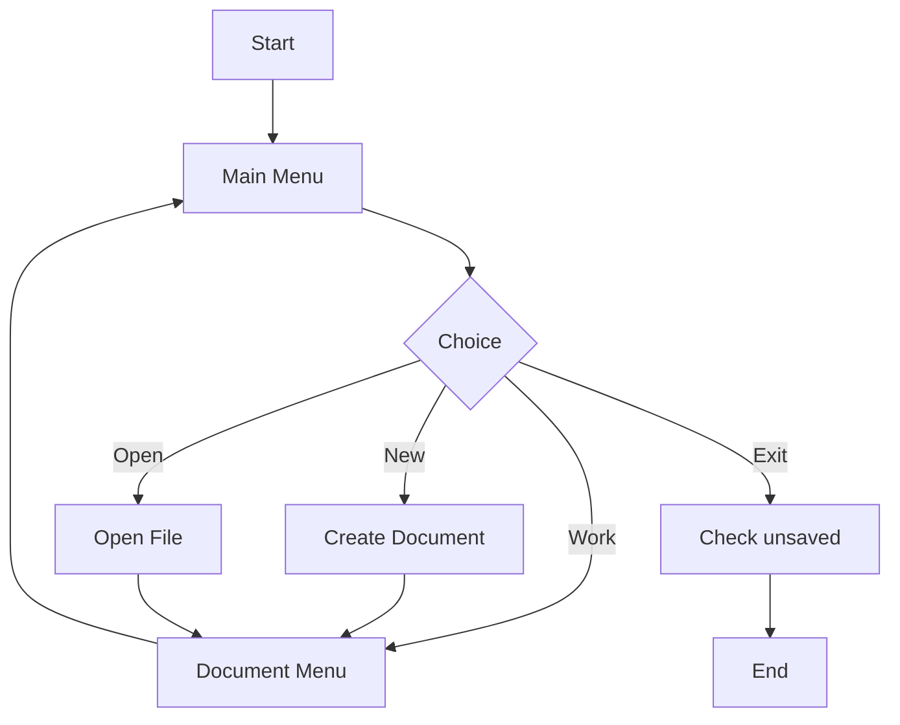
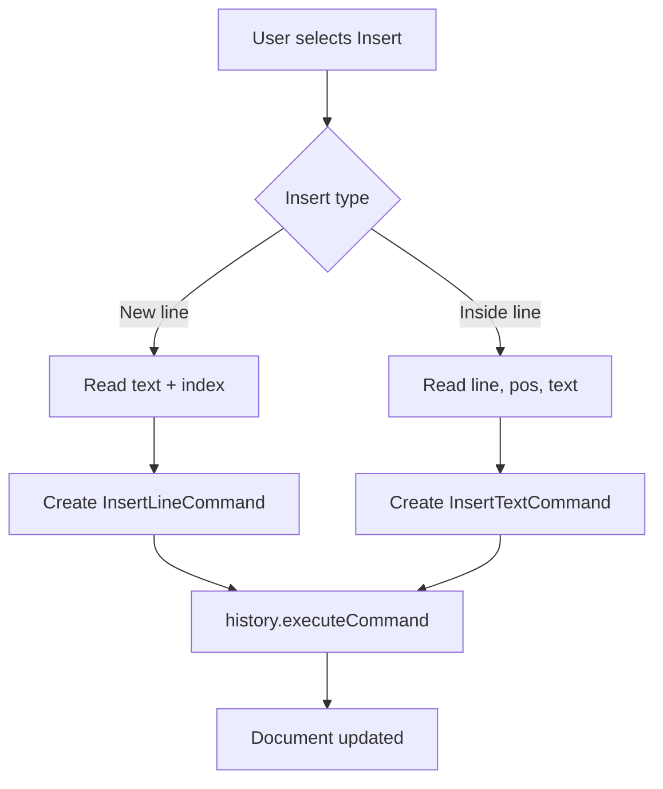
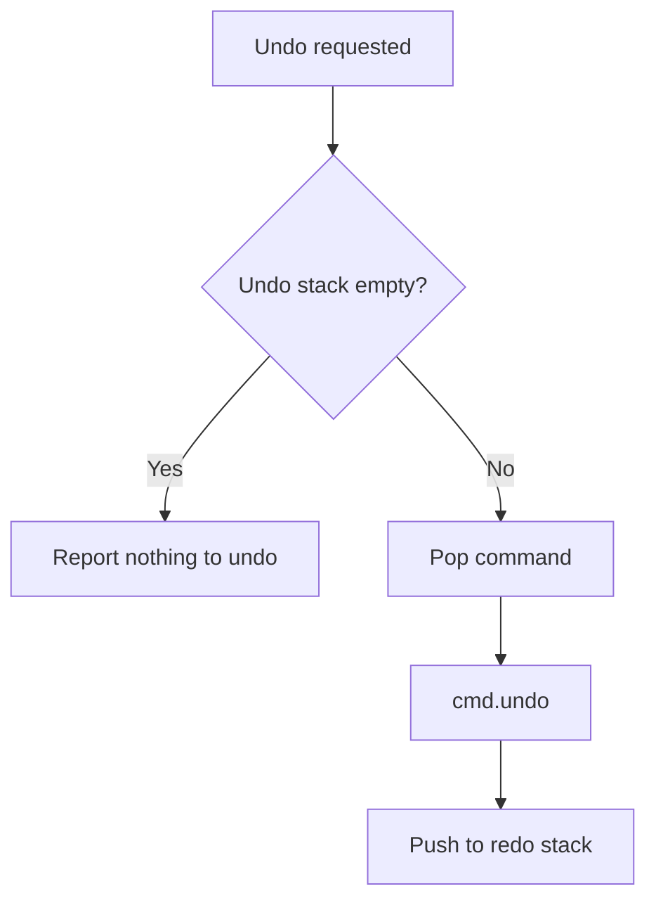
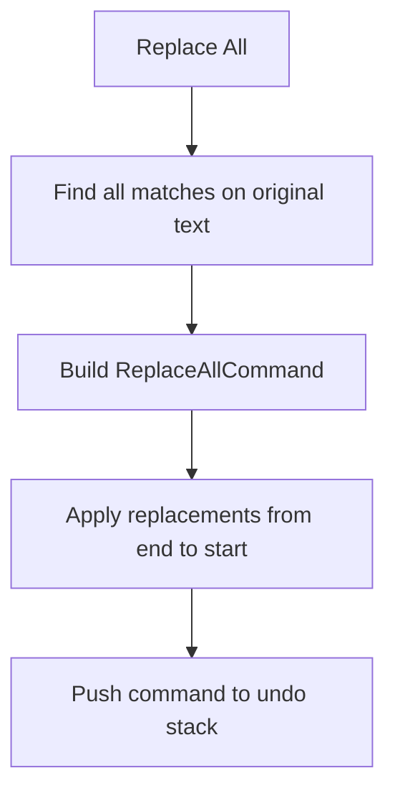

# Flowcharts (Mermaid)

## Overall Application

```mermaid
flowchart TD
    A[Start] --> B[Main Menu]
    B --> C{Choice}
    C -->|New| D[Create Document]
    C -->|Open| E[Open File]
    C -->|Work| F[Document Menu]
    C -->|Exit| G[Check unsaved]
    G --> H[End]
    D --> F
    E --> F
    F --> B
```

## Insert Operation

```mermaid
flowchart TD
    A[User selects Insert] --> B{Insert type}
    B -->|New line| C[Read text + index]
    B -->|Inside line| D[Read line, pos, text]
    C --> E[Create InsertLineCommand]
    D --> F[Create InsertTextCommand]
    E --> G[history.executeCommand]
    F --> G
    G --> H[Document updated]
```

## Undo / Redo

```mermaid
flowchart TD
    A[Undo requested] --> B{Undo stack empty?}
    B -->|Yes| C[Report nothing to undo]
    B -->|No| D[Pop command]
    D --> E[cmd.undo]
    E --> F[Push to redo stack]
```

## Search & Replace All

```mermaid
flowchart TD
    A[Replace All] --> B[Find all matches on original text]
    B --> C[Build ReplaceAllCommand]
    C --> D[Apply replacements from end to start]
    D --> E[Push command to undo stack]
```
